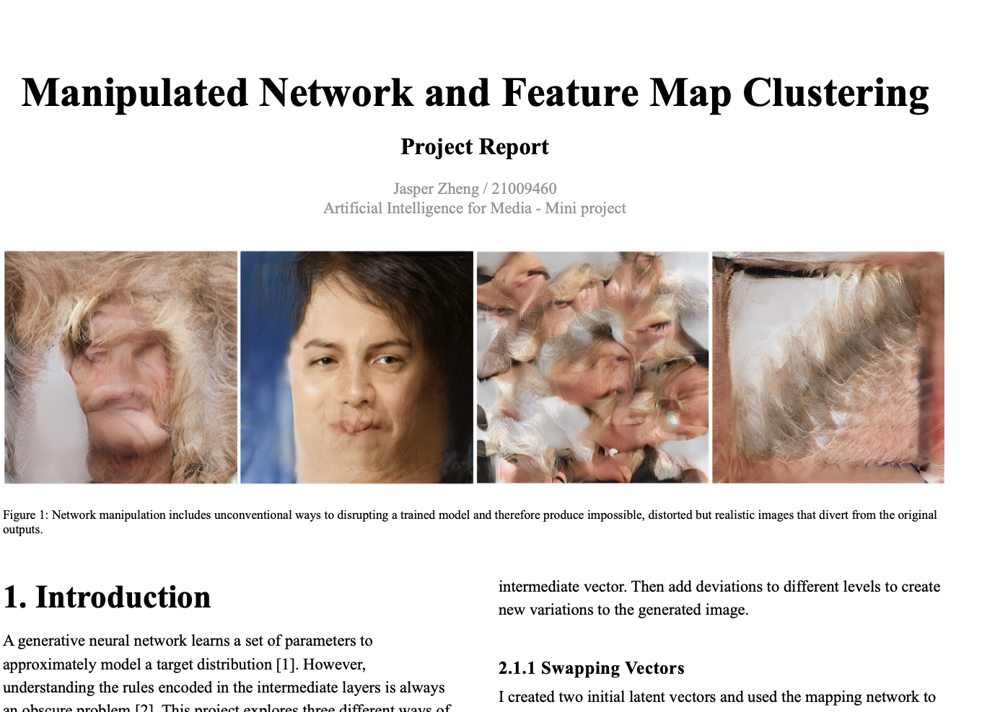

# Manipulated Network and Feature Map Clustering  
###### Msc Artificial Intelligence for Media     
Jasper Zheng (Shuoyang) / 21009460  

   

This project explores three methods of manipulating pre-trained StyleGAN [1] models: intermediate latent space truncation [2], layers' weights manipulation and Network Bending [3]. It also used VGG16 feature extraction model and KMean algorithm to cluster the feature maps in the intermediate layers to create more interpretable outcomes. Finally, it re-implemented a set of network bending operations to a code interface and showcased a series of novel images produced by the manipulated models.  

[Project Report](./project_report.pdf)

## Requirements  
The
